# AI System Engineering Methodology

Методология и набор skills для превращения идеи, сырого текста или существующего ТЗ в согласованный пакет BA- и engineering-документации. Основной сценарий — работа через Codex; Cursor поддерживается тем же portable bundle.

## Что делает система

1. При необходимости проверяет жизнеспособность новой стартап-идеи в России.
2. Проверяет критичные продуктовые гипотезы короткими измеримыми экспериментами до дорогой разработки.
3. Нормализует вход и явно фиксирует факты, допущения, противоречия и открытые вопросы.
4. Проводит вход через problem framing, требования, моделирование, архитектуру, спецификации, план и validation.
5. Сохраняет состояние в `RUN.md`, чтобы прогон можно было продолжить в следующем task.
6. Не скрывает gaps: каждый вопрос получает gate-статус и допустимое следующее действие.

Все выходные артефакты по умолчанию оформляются на русском языке. Английский допустим только для технических сокращений, идентификаторов, имён технологий и дословных цитат. Полное правило: [output-language-policy.md](skills/_shared/references/output-language-policy.md).

## Быстрый старт с Codex

```bash
git clone git@github.com:tduhfajd/AI-System-Engineering-Methodology.git
cd AI-System-Engineering-Methodology
cp -R ./codex-skills/* ~/.codex/skills/
```

После установки в `~/.codex/skills` должны находиться папки skills и `_asef-shared`. Начните новый task и передайте агенту входной файл и папку для результатов:

```text
$methodology-orchestrator возьми ~/project/tz.md, выбери подходящий режим и сохраняй все артефакты в ~/project/asef-run
```

## Быстрый старт с Cursor

Скопируйте содержимое `cursor-skills/` в `.cursor/skills/` проекта либо в `~/.cursor/skills/`. Папка `_asef-shared` должна лежать рядом с каталогами skills.

В Cursor skill можно вызвать естественным запросом:

```text
Используй methodology-orchestrator: проанализируй ./tz.md, выбери режим и сохрани результаты в ./asef-run.
```

## Как выбрать маршрут

### 1. Новая стартап-идея в России

Если не подтверждены проблема, спрос, рынок, канал или экономика, начните с pre-gate:

```text
$roast-startup-ru прожарь идею сервиса для ... в режиме интерактивный. Сохрани verdict, гипотезы и эксперименты в ~/project/asef-run/RUN.md
```

`$roast-startup-ru` вернёт `GO`, `VALIDATE`, `PIVOT` или `STOP`.

- `GO` — переходите к Stage 0.
- `VALIDATE` — передайте наиболее рискованную гипотезу в `$fast-track-validation`.
- `PIVOT` — измените идею и повторите проверку.
- `STOP` — не начинайте спецификацию без явного решения продолжать вопреки verdict.

Подробный контракт передачи: [idea-viability-pre-gate.md](methodology/idea-viability-pre-gate.md).

### 2. Проверьте критичную гипотезу

Если спрос, проблема, цена, канал или ожидаемое поведение ещё не подтверждены, используйте Fast Track до спецификации и разработки:

```text
$fast-track-validation возьми гипотезы и verdict из ~/project/asef-run/RUN.md. Выбери одну наиболее рискованную гипотезу, подготовь минимальный измеримый эксперимент с заранее заданным порогом и сохрани план в ту же папку
```

Skill отделяет факты от предположений, выбирает самый дешёвый эксперимент, способный опровергнуть гипотезу, и возвращает:

- статус эксперимента `PLANNED`, `RUNNING`, `COMPLETED` или `CANCELLED`;
- `PENDING`, пока данных недостаточно для финального решения;
- `PROCEED` — evidence достаточно для передачи подтверждённых фактов и остаточных рисков в Stage 0;
- `ITERATE` — сигнал неоднозначен или тест спроектирован недостаточно хорошо;
- `PIVOT` — текущая гипотеза опровергнута, но стоит проверить другой сегмент, ценность, канал или решение;
- `STOP` — продолжение проверки или разработки не оправдано имеющимся evidence.

Финальное решение выносится только при `COMPLETED`. При `PLANNED`, `RUNNING` или `CANCELLED` решение остаётся `PENDING`; отсутствие данных нельзя маскировать под `ITERATE`. Порог успеха, срок, бюджет, выборка и правило решения фиксируются до получения результатов. Лайки, комплименты и абстрактное намерение не считаются сильным доказательством спроса. Skill не выдаёт придуманные результаты и не повышает readiness при незавершённой критичной проверке.

`$fast-track-validation` — собственный открытый контракт проекта на основе общих принципов проверяемых продуктовых экспериментов. Он не заявлен как точная реализация какой-либо закрытой или авторской методологии Fast Track.

### 3. Выберите режим orchestrator

| Режим | Когда использовать | Результат |
|---|---|---|
| `quick_discovery` | Идея или сырой бриф; нужен быстрый, но структурированный старт | Stage 0–2: нормализованный бриф, проблема, требования, правила, варианты использования и критерии приёмки |
| `full_delivery` | Нужен пакет для передачи в разработку | Полный маршрут Stage 0–7 с human checkpoints |
| `existing_spec_review` | Уже есть ТЗ и нужно найти gaps, противоречия или усилить его | Нормализация и targeted review без автоматической генерации полного пакета |

Примеры:

```text
$methodology-orchestrator обработай ~/project/idea.md в режиме quick_discovery; результаты в ~/project/asef-run
```

```text
$methodology-orchestrator проверь ~/project/existing-spec.md в режиме existing_spec_review; результаты в ~/project/asef-run
```

```text
$methodology-orchestrator проведи ~/project/approved-brief.md через full_delivery; останавливайся на обязательных human checkpoints; результаты в ~/project/asef-run
```

## Что происходит в полном маршруте

```mermaid
flowchart LR
  V["Pre-gate: жизнеспособность идеи (опционально)"] --> F["Fast Track: критичная гипотеза (при необходимости)"]
  F --> S0["0. Нормализация"]
  S0 --> S1["1. Проблема и ценность"]
  S1 --> S2["2. Требования"]
  S2 --> S3["3. Модель системы"]
  S3 --> S4["4. Архитектура"]
  S4 --> S5["5. Спецификации"]
  S5 --> S6["6. План"]
  S6 --> S7["7. Validation"]
  S5 -. независимая проверка .-> R["Independent Package Review"]
  S7 -. независимая проверка .-> R
```



| Этап | Основной результат | Когда требуется человек |
|---|---|---|
| 0. Нормализация | Бриф, реестры assumptions, contradictions и вопросов | Если противоречие меняет scope или решение |
| 1. Формализация проблемы | Проблема, акторы, цели, non-goals, метрики, риски | Подтверждение problem framing и границ |
| 2. Требования | Требования, business rules, use cases, acceptance criteria | Подтверждение high-impact поведения |
| 3. Моделирование | Flows, состояния, domain/data model | При неясной доменной логике или данных |
| 4. Архитектура | Компоненты, интерфейсы, ownership, решения | Подтверждение ключевых trade-offs |
| 5. Спецификации | PDD, FS, SDD, NFR, API, data/UX и BA-артефакты | Подтверждение пакета перед планированием |
| 6. Планирование | Work packages, зависимости, milestones, risks | При выборе release boundaries |
| 7. Validation | Readiness decision, scoring, defects и handoff | Подтверждение готовности или ограничений |

## RUN.md и работа между task

В папке результатов orchestrator создаёт или обновляет `RUN.md`. Это источник текущего состояния: выбранный режим, текущий этап, артефакты, решения, вопросы, blockers и следующий шаг.

Чтобы продолжить работу в новом task, передайте файл явно:

```text
$methodology-orchestrator продолжи прогон по ~/project/asef-run/RUN.md и существующим stage packets
```

Не удаляйте `RUN.md` и `*-stage-packet.json`: они нужны, чтобы следующий skill не восстановил контекст по догадке.

## Как gates обрабатывают вопросы

| Категория | Значение | Действие |
|---|---|---|
| `implementation_blocker` | Без решения небезопасно начинать реализацию или выпуск | Не передавать пакет в разработку |
| `stage_blocker` | Следующий конкретный этап невозможно выполнить корректно | Остановить этот переход и запросить решение |
| `carry_forward` | Вопрос не мешает текущему этапу | Сохранить в `RUN.md`, stage packet и последующем review |

`carry_forward` не является автоматическим блокером: у него всё равно должны быть владелец, срок или условие пересмотра.

## Выбор объёма документации

Не все проекты требуют весь набор артефактов. На Stage 1 фиксируется минимально достаточный пакет согласно [матрице применимости](methodology/artifact-applicability-matrix.md): для небольшого веб-сервиса он компактнее, для API/интеграции, AI-системы или регулируемого B2B-проекта — шире.

Исключённый артефакт не «забывается»: его отсутствие должно быть обосновано в scope и validation.

## Все skills

### Вход и orchestration

| Skill | Используйте, когда |
|---|---|
| `$roast-startup-ru` | Нужно проверить жизнеспособность новой стартап-идеи в России до решения о разработке |
| `$fast-track-validation` | Нужно проверить критичную гипотезу коротким измеримым экспериментом до дорогой спецификации или разработки |
| `$methodology-orchestrator` | Нужен маршрут, выбор режима, gates, `RUN.md` и передача между этапами |

### Основные этапы

| Skill | Используйте, когда |
|---|---|
| `$stage-00-normalization` | Нужно структурировать идею, сырой текст или готовое ТЗ |
| `$stage-01-problem-formalization` | Нужны проблема, акторы, scope, метрики, минимальный пакет артефактов и гипотеза ценности |
| `$stage-02-requirements-extraction` | Нужны тестируемые требования, правила, use cases и acceptance criteria |
| `$stage-03-system-modeling` | Нужны потоки, состояния, доменная модель и данные |
| `$stage-04-architecture-design` | Нужны компоненты, границы, интерфейсы и архитектурные решения |
| `$stage-05-specification-assembly` | Нужно собрать финальный пакет документации из валидированных результатов |
| `$stage-06-planning` | Нужен исполнимый план delivery |
| `$stage-07-validation` | Нужно оценить readiness, defects, остаточные риски и условия handoff |

### Точечные и проверочные skills

| Skill | Используйте, когда |
|---|---|
| `$artifact-template-loader` | Нужен канонический шаблон конкретного артефакта |
| `$stakeholder-glossary-builder` | Нужны stakeholder map и glossary |
| `$business-rules-extractor` | Нужно выделить бизнес-правила и ограничения |
| `$use-case-modeler` | Нужна модель вариантов использования и exception flows |
| `$domain-data-modeler` | Нужны domain model, data dictionary и lifecycle сущностей |
| `$acceptance-criteria-builder` | Нужны проверяемые критерии приёмки, negative cases и UAT checks |
| `$traceability-checker` | Нужно найти разрывы между входом, требованиями, проектированием и validation |
| `$scoring-evaluator` | Нужно посчитать scoring и confidence отдельным pass |
| `$independent-package-review` | Нужна независимая проверка пакета после Stage 5 или 7; он не генерирует недостающие документы вместо фиксации defects |

## Практические запросы

### Проверить гипотезу до разработки

```text
$fast-track-validation проверь гипотезу «малые интернет-магазины готовы оставить депозит за автоматизацию возвратов». Не разрабатывай продукт: выбери минимальный этичный эксперимент, заранее зафиксируй метрику, пороги PROCEED/ITERATE/PIVOT/STOP, срок и бюджет; сохрани результат в ~/project/asef-run
```

### Усилить готовое ТЗ

```text
$methodology-orchestrator возьми ~/project/tz.md в режиме existing_spec_review. Найди contradictions, gaps и нетестируемые требования; сохрани review и RUN.md в ~/project/asef-run
```

### Собрать только business rules

```text
$business-rules-extractor выдели бизнес-правила из ~/project/tz.md, укажи источник каждого правила и сохрани каталог в ~/project/asef-run
```

### Проверить пакет независимо

```text
$independent-package-review проверь ~/project/asef-run после Stage 7. Не дописывай документы; верни evidence, blockers, advisory improvements и verdict готовности
```

### Повторить один этап

```text
$stage-03-system-modeling используй ~/project/asef-run/02-stage-packet.json и связанные артефакты; обнови RUN.md и подготовь вход для Stage 4
```

## Если использовать методологию вручную

Читайте [methodology/README.md](methodology/README.md), выбирайте нужные шаблоны из [templates](templates) и сверяйтесь с [automation](automation). Для нового продукта сначала используйте [матрицу применимости](methodology/artifact-applicability-matrix.md), чтобы не создавать лишние документы.

## Структура репозитория

```text
AI-System-Engineering-Methodology/
├── methodology/      # этапы, pre-gate и матрица применимости
├── templates/        # русскоязычные шаблоны результатов
├── automation/       # stage contracts, gates и scoring
├── skills/           # единственный источник skills
├── codex-skills/     # генерируемый bundle для Codex
├── cursor-skills/    # генерируемый bundle для Cursor
└── scripts/          # сборка и проверки
```

## Поддержка bundles и проверки

Редактируйте исходники в `skills/`, `methodology/`, `templates/` и `automation/`; не изменяйте `codex-skills/` и `cursor-skills` вручную. После изменений выполните:

```bash
bash scripts/build-bundles.sh
bash scripts/verify-language-contract.sh
bash scripts/verify-workflow-extensions.sh
```

`build-bundles.sh --check` проверяет, что portable bundles соответствуют исходникам.

## Автор

Вадим Евграфов — [Telegram @vadim_evgrafov](https://t.me/vadim_evgrafov) · [vadim@evgrafov.biz](mailto:vadim@evgrafov.biz)
